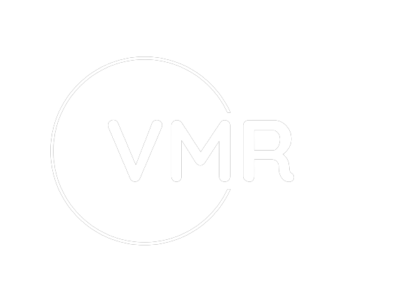

  

# Video Moment Retrieval App 🎥

  <i>Find moments in videos effortlessly.</i>

## Overview 📜

The Video Moment Retrieval App is a sophisticated web application that leverages deep learning technology to help users search for specific moments in videos by entering text queries. Built using Django, TensorFlow, and other powerful libraries, this app offers a seamless and efficient video retrieval experience.

## Features 🚀

- **Intuitive Video Search**: Easily find the exact moments you're looking for in videos by entering text-based queries.

- **User Authentication**: A secure login and signup system ensure a personalized and safe user experience.

- **Session Archives**: Access your previous retrieval sessions to revisit past queries and results.

- **Contact Support**: Connect with our support team or administrators effortlessly through the built-in contact feature.

- **Personalization Options**: Customize and tailor your experience with various settings and preferences.

## Technologies 🛠️

- **Django**: Our robust backend is powered by Django, a high-level Python web framework.

- **TensorFlow**: Deep learning models are implemented using TensorFlow, providing accurate video analysis.

- **NumPy**: A fundamental library for numerical operations and data manipulation.

- **Frontend Magic**: The frontend is elegantly crafted using HTML, CSS, and JavaScript to ensure a responsive and interactive user interface.

## Real-Life Applications 🌐

The Video Moment Retrieval App finds utility in a wide range of real-life scenarios:

- **Sports Highlight Generation**: Create stunning sports highlight reels by easily extracting specific moments from videos.

- **Video Editing Assistant**: Simplify video editing by swiftly locating and extracting desired scenes from lengthy video files.

- **Security Footage Analysis**: Efficiently review surveillance footage by searching for specific incidents or events.

## Getting Started 🚀

To run the app locally, follow these steps:

1. Clone this repository to your local machine.

2. Install the required dependencies, including Django, TensorFlow, and other Python packages listed in the requirements.txt file.

3. Configure your database settings in the Django settings file.

4. Run the Django development server.

5. Access the app in your web browser at `http://localhost:8000`.

## Usage 📝

- Register or log in to the app.

- Enter a text query to search for specific moments in a video.

- Review and interact with the search results.

- Access your previous sessions and personalize your experience through the app's features.

## Contributing 🤝

We welcome contributions to enhance this project.

## Contact Us 📧

If you have any questions or feedback, please don't hesitate to reach out at [sahasharad29@gmail.com](mailto:sahasharad29@gmail.com).

  <i>Discover the power of precise video retrieval with the Video Moment Retrieval App.</i>

